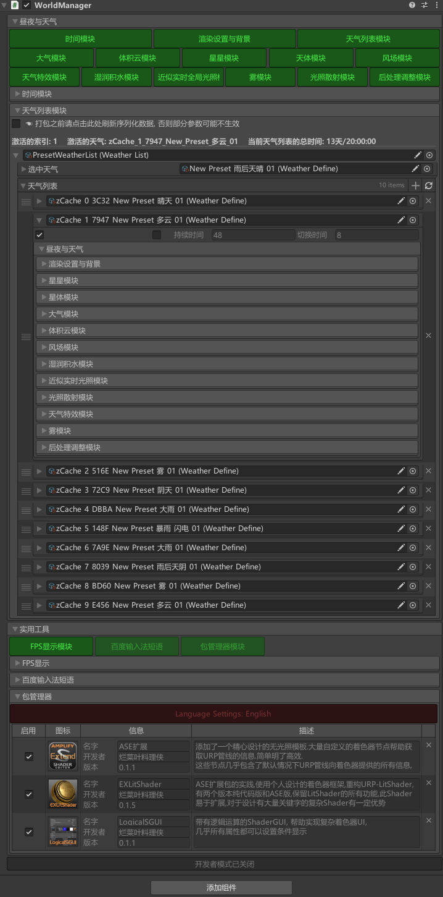
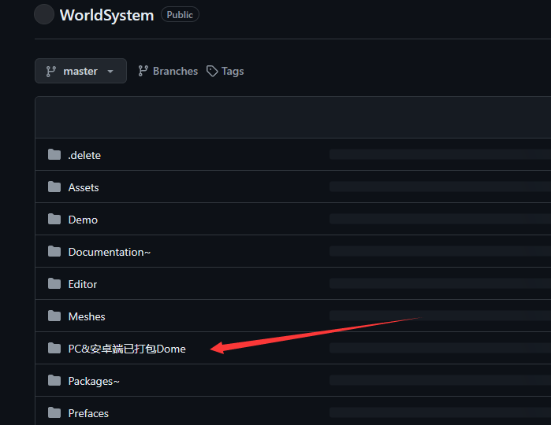
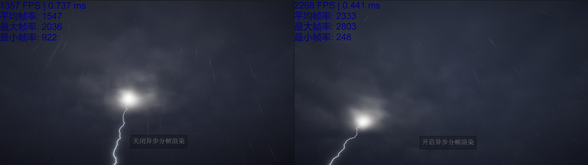
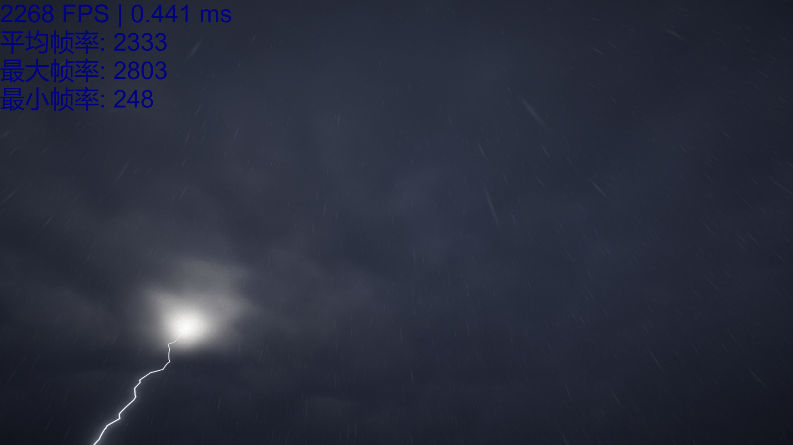
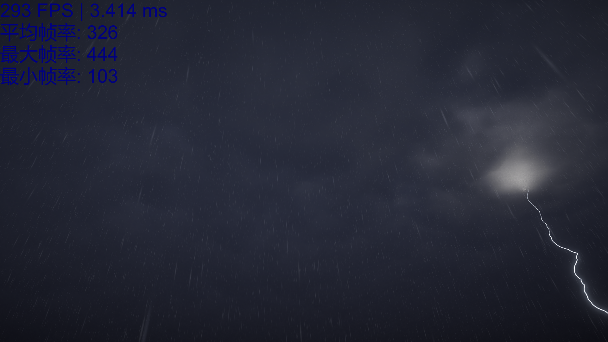
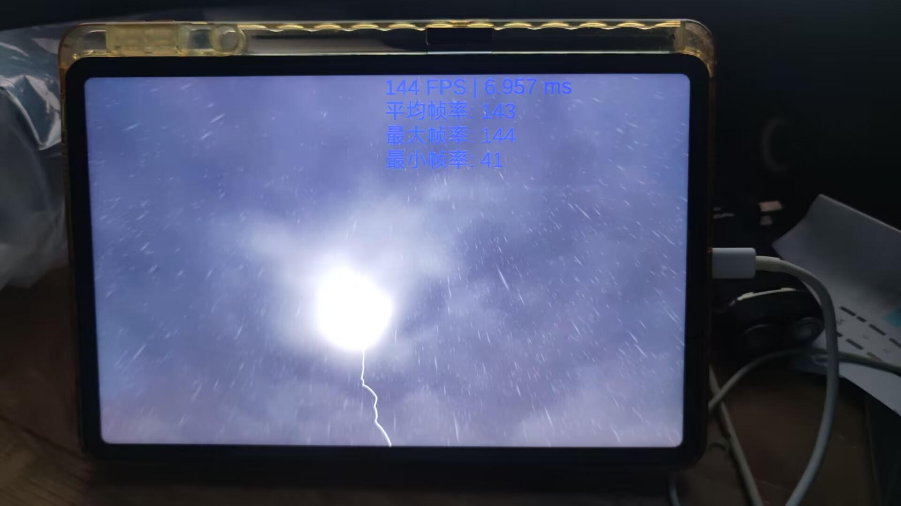
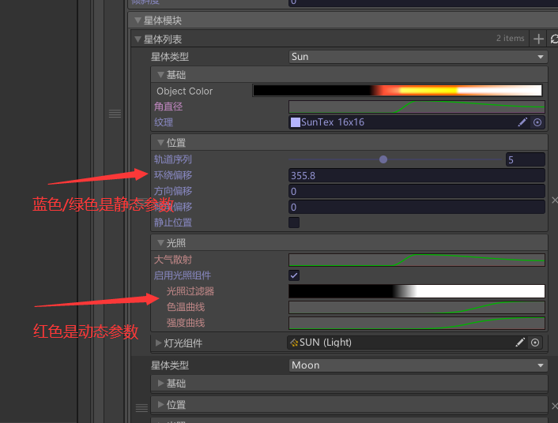
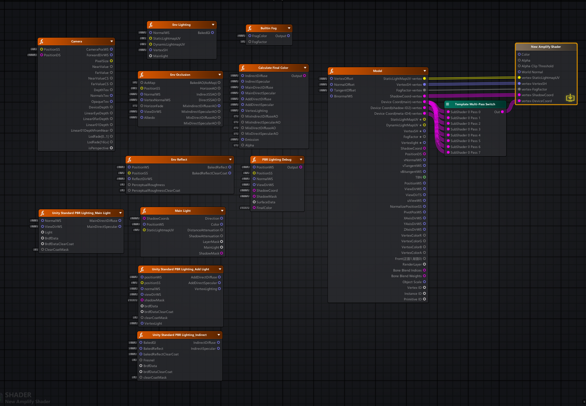
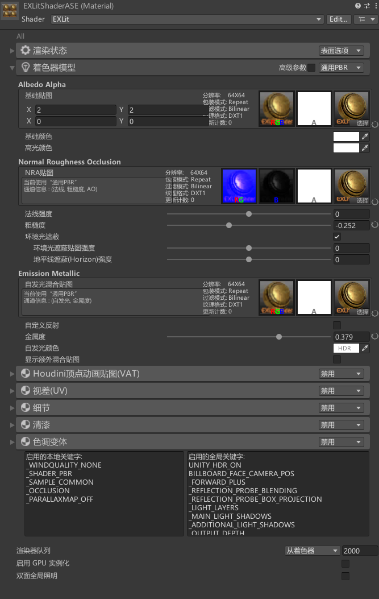



# 简介
- 简单易用的高性能昼夜天气系统 (体积云方案) , 使用原创的异步+分帧的渲染方法 , 打造极致性能
- 完全模块化设计, 编写模块轻松扩展功能 , 这也是包名 "WorldSystem" 包含的 "野心" , 我希望它不仅仅是一套昼夜天气的方案 , 而是包含游戏需要的各种渲染效果, 它们都会以模块提供 , 这是一个长期目标.
- 实现开发者/使用者不同面板, 当开启开发者模式时, 将显示所有隐藏信息, 方便开发调试, 但是面板会变得不整洁, "WorldManager" 的子物体也会暴露. 关闭开发者模式, 将会得到一个整洁的面板, 子物体也将隐藏, 大幅提高安全性
- 开发了一个简单的包管理器, 可以将个人写的一些包, 工具, 库, 集中起来管理, 非常方便.

  有同学要问了, 为啥不使用Unity自带的包管理器. 我们有些时候只是写一些小包/小库/小工具, 它们可能只是几个Shader, 根本没必要安装到Packages, 放到Assets缺乏管理手段, 混乱且安全性低, 为解决这些痛点开发了 "包管理器模块" , 你甚至可以将编写的模块安装到包管理器, 实现更精细化的管理
  
- 包管理器中额外提供了三个我开发的包
    1. ASE扩展 :  添加了一个精心设计的无光照模板.大量自定义的着色器节点帮助获取URP管线的信息.简单明了高效. 这些节点几乎包含了默认情况下URP管线向着色器提供的所有信息, 轻松实现URP-Lit的所有功能, 扩展也很容易, 确保无冗余, 变体完全可控
    2. LogicalSGUI:  带有逻辑运算的ShaderGUI, 帮助实现复杂着色器UI, 几乎所有属性都可以设置条件显示 (满足条件时显示, 不满足时隐藏)
    3. EXLitShader:  ASE扩展包的实践,重构URP-Lit, 有两个版本纯代码版和ASE版, 在保留URP-Lit所有功能的基础上进行扩展. 着色器框架易于扩展, 对于设计有大量关键字的复杂Shader有一定优势

如果你基于此包开发了新的模块, 请开源一份源码给我, 感谢, 联系方式: QQ 1991997034

# 提供已打包的Dome下载

这里已经有打包好的可运行程序, 可以直接下载运行查看效果

# 原创的异步分帧渲染方法
开启关闭异步分帧渲染的帧率对比 :

实时帧率有900+的提升, 平均帧率,最大帧率都有700~800+的提升, 目前测试用的电脑是3090的显卡, 如果在低端设备提升将会更加明显, 异步分帧对于GPU集中的渲染, 优化效果越明显

这里简单说明一下异步分帧的原理.
- 异步渲染 : 降低渲染速率 ( 默认20Fps/S ), 例如场景以1000Fps/S的速率渲染, 天空盒以20Fps/S的速率渲染, 天空盒由于渲染速率太低会出现 "不跟手" "晃动" , 我的解决方案是 : 对天空盒RT单独提升视野, 再计算运动矢量对其进行修正, 最后将天空盒RT的视野映射回去.
- 分帧渲染 : 每帧渲染屏幕的一部分, 将一帧渲染完毕的效果分散到多帧, 他与异步渲染相辅相成. 目前此包只实现了分两帧 ( 一帧渲染左半部分, 下一帧渲染右半部分)

# 实机测试
以下均为IL2CPP打包
- PC端 : 3090显卡+5900X  渲染分辨率1920x1080 峰值帧率2800+, 平均帧率2300+

  

- PC端 : 2060显卡  渲染分辨率1920x1080 峰值帧率1480+, 平均帧率1300+ (热心网友测试)
- PC端 : 十年前的笔记本电脑  980m显卡  渲染分辨率1920x1080 峰值帧率440+, 平均帧率320+
  
  

- 安卓端 : 小米平板6p  骁龙8+  渲染分辨率1440x900  峰值帧率144+  平均帧率144+    
  由于移动端的限制帧率无法突破屏幕刷新率,实际能跑到的帧率不止144
  

# 使用方法
1. 创建一个空游戏对象 , 添加组件 WorldManager
2. 开启 "昼夜与天气" 下的所有模块

# 文档
注意:
1. 红色是动态参数, 它们将在天气切换时进行线性插值,
2. 紫色是动态参数, 但是在所有的天气中保持一致, 只在昼夜变换中是动态的
3. 蓝色绿色是静态参数, 它们的值将在所有的天气中保持一致

| 参数                             | 描述                                                                                                                                                      |     |
| :----------------------------- | :------------------------------------------------------------------------------------------------------------------------------------------------------ | --- |
|                                |                                                                                                                                                         |     |
| **时间模块**                       |                                                                                                                                                         |     |
| 初始时间                           | 设置游戏的初始日期和时间                                                                                                                                            |     |
| 游戏时间                           | (只读) 游戏内当前的日期和时间                                                                                                                                        |     |
| 使用昼夜循环                         | 开启之后游戏内时间前进                                                                                                                                             |     |
| 昼夜循环(分钟)                       | 设置游戏内一昼夜对应现实中的时间                                                                                                                                        |     |
|                                |                                                                                                                                                         |     |
|                                |                                                                                                                                                         |     |
| **渲染设置与背景**                    |                                                                                                                                                         |     |
| 分辨率选项                          | Full: 满分辨率渲染天空盒 Half: 半分辨率渲染,开启TAA降噪 Quarter: 四分之一分辨率渲染,开启TAA降噪                                                                                   |     |
| TAA降噪减弱                        | 分辨率选项设置为 Half或Quarter 时显示, 等于一将完全关闭TAA效果                                                                                                                |     |
| 目标帧率                           | Target Fps Un Limit: 使用平台默认的帧率, PC无限制, 在移动端将会被限制到30Fps Target Fps240等: 限制到指定帧率                                                                       |     |
| 使用异步分帧渲染                       | 开启异步渲染与分帧渲染 , 性能大幅提高                                                                                                                                    |     |
| 异步更新率(fps/s)                   | 开启 使用异步分帧渲染 显示, 设置天空盒的异步渲染速率, 默认20Fps, 每秒渲染20次天空盒                                                                                                       |     |
| 扩大的视野                          | 开启 使用异步分帧渲染 显示, 渲染天空盒RT时扩大的视野                                                                                                                           |     |
|                                |                                                                                                                                                         |     |
|                                |                                                                                                                                                         |     |
| **星星模块**                       |                                                                                                                                                         |     |
| 星星计数                           | 设置星星的数量                                                                                                                                                 |     |
| 星星大小                           | 设置星星的大小                                                                                                                                                 |     |
| 自动亮度                           | 开启基于现实测量的星星亮度                                                                                                                                           |     |
| 自动颜色                           | 开启基于现实测量的星星颜色                                                                                                                                           |     |
| 星星颜色                           | 星星颜色将乘以此值                                                                                                                                               |     |
| 亮度                             | 设置星星的亮度                                                                                                                                                 |     |
| 闪烁频率                           | 设置闪烁频率                                                                                                                                                  |     |
| 闪烁强度                           | 设置闪烁强度                                                                                                                                                  |     |
| 随机种                            | 随机星星位置                                                                                                                                                  |     |
| 倾斜度                            | 倾斜旋转星星                                                                                                                                                  |     |
|                                |                                                                                                                                                         |     |
|                                |                                                                                                                                                         |     |
| **星体模块**                       | 注意: 主平行光位于此模块, 不要再场景中添加主灯光了                                                                                                                             |     |
| 星体列表                           | 当前的所有星体, 默认为太阳与月亮, 点击"+"可添加其他星体,点击"+"旁边的按钮根据 轨道序列 重置列表顺序, 列表顺序也是星体的渲染顺序                                                                                 |     |
| 星体类型                           | Sun: 日间渲染体积云阴影时将会以此为准 Moon: 夜间渲染体积云阴影时将会以此为准 Other: 其他星体                                                                                          |     |
| 基础-ObjectColor                 | 设置对象的基础颜色, 在一昼夜中将会按此渐变设置                                                                                                                                |     |
| 基础-角直径                         | 设置星体的大小                                                                                                                                                 |     |
| 基础-纹理                          | 设置星体的纹理                                                                                                                                                 |     |
|                                |                                                                                                                                                         |     |
| 位置-轨道序列                        | 决定了星体的远近, 和渲染顺序                                                                                                                                         |     |
| 位置-环绕偏移                        | 星体沿着轨道偏移                                                                                                                                                |     |
| 位置-方向偏移                        | 星体轨道以地心为中心Y轴为旋转轴旋转                                                                                                                                      |     |
| 位置-倾角偏移                        | 偏移星体轨道中心                                                                                                                                                |     |
| 位置-静止位置                        | 开启后星体位置不受昼夜变换的影响 (静止不动)                                                                                                                                 |     |
|                                |                                                                                                                                                         |     |
| 光照-大气散射                        | 设置星体的光照在大气中的散射强度, 在一昼夜中将会按此曲线设置                                                                                                                         |     |
| 光照-启用光照组件                      | 开启后将会附加一个灯光组件                                                                                                                                           |     |
| 光照-光照过滤器                       | 开启 启用光照组件 显示, 设置灯光组件的光照过滤, 在一昼夜中将会按此渐变设置                                                                                                                |     |
| 光照-色温曲线                        | 开启 启用光照组件 显示, 设置灯光组件的色温, 在一昼夜中将会按此曲线设置                                                                                                                  |     |
| 光照-强度曲线                        | 开启 启用光照组件 显示, 设置灯光组件的强度, 在一昼夜中将会按此曲线设置                                                                                                                  |     |
| 光照-灯光组件                        | 开启 启用光照组件 显示, 常规灯光组件的设置                                                                                                                                 |     |
|                                |                                                                                                                                                         |     |
|                                |                                                                                                                                                         |     |
| **大气模块**                       |                                                                                                                                                         |     |
| 颜色-时段                          | 设置一昼夜中各个时间的天空盒颜色, 昼夜变换中将会按顺序线性插值                                                                                                                        |     |
| 大气混合-使用大气混合                    | 开启大气混合, 在场景中添加大气雾效                                                                                                                                      |     |
| 开始                             | 开启 使用大气混合 显示, 大气混合开始距离                                                                                                                                  |     |
| 结束                             | 开启 使用大气混合 显示, 大气混合结束距离                                                                                                                                  |     |
|                                |                                                                                                                                                         |     |
|                                |                                                                                                                                                         |     |
| **体积云模块**                      |                                                                                                                                                         |     |
| 渲染-最大渲染距离(m)                   | 体积云渲染距离                                                                                                                                                 |     |
| 渲染-粗略步进                        | 粗略步进越大噪点越少, 效果越精细 , 对性能有负面影响                                                                                                                            |     |
| 渲染-细节步进                        | 体积云的分层步进                                                                                                                                                |     |
| 渲染-噪音                          | 消除体积云的分层                                                                                                                                                |     |
| 渲染-Mipmap距离                    | 减弱远处的体积云细节                                                                                                                                              |     |
|                                |                                                                                                                                                         |     |
| 建模-云量                          | 体积云覆盖天空的程度                                                                                                                                              |     |
| 建模-覆盖远程云量                      | 开启将单独设置远处的云量                                                                                                                                            |     |
| 建模-开始距离(m)                     | 开启 覆盖远程云量 显示, 设置覆盖远程云量的作用距离                                                                                                                             |     |
| 建模-云量                          | 开启 覆盖远程云量 显示, 设置远处的云量                                                                                                                                   |     |
| 建模-星球半径预设                      | 各种预设好的星球半径                                                                                                                                              |     |
| 建模-星球半径(km)                    | 当 星球半径预设为Custom时启用 , 设置星球半径, 越小的半径, 体积云越在远处下坠                                                                                                           |     |
| 建模-云层海拔(m)                     | 云层高度                                                                                                                                                    |     |
| 建模-云层厚度(m)                     | 云层厚度                                                                                                                                                    |     |
| 建模-八度音程                        | 实时渲染的基础2D云图的参数                                                                                                                                          |     |
| 建模-增益                          | 实时渲染的基础2D云图的参数                                                                                                                                          |     |
| 建模-频率                          | 实时渲染的基础2D云图的参数                                                                                                                                          |     |
| 建模-比例                          | 实时渲染的基础2D云图的参数                                                                                                                                          |     |
| 建模-3D噪音                        | 体积云的细节3D纹理                                                                                                                                              |     |
| 建模-类型                          | 设置3D纹理的类型                                                                                                                                               |     |
| 建模-质量                          | 设置3D纹理的分辨率                                                                                                                                              |     |
| 建模-比例                          | 设置3D纹理的Scale                                                                                                                                            |     |
|                                |                                                                                                                                                         |     |
| 运动-使用动态体积云                     | 开启后体积云为动态                                                                                                                                               |     |
| 运动-基础(云图)-动态矢量                 | 基础云图的运动方向和速度(只读) 由下方参数计算                                                                                                                                |     |
| 运动-基础(云图)-速度                   | 基础云图的运动速度                                                                                                                                               |     |
| 运动-基础(云图)-使用方向随机               | 开启基础云图运动方向随机                                                                                                                                            |     |
| 运动-基础(云图)-随机范围                 | 开启 使用随机 显示, 基础云图的运动方向随机范围 , 如果为60, 将在-60到60度之间随机                                                                                                        |     |
| 运动-基础(云图)-随机频率                 | 开启 使用随机 显示, 基础云图的运动方向随机频率, 如果为12则会在一个昼夜随机12次                                                                                                            |     |
| 运动-细节-动态矢量                     | 体积云细节的运动方向和速度(只读) 由下方参数计算                                                                                                                               |     |
| 运动-细节-速度                       | 体积云细节的运动速度                                                                                                                                              |     |
| 运动-细节-使用随机                     | 开启体积云细节的运动方向随机                                                                                                                                          |     |
| 运动-细节-随机范围                     | 开启 使用随机 显示, 体积云细节的运动方向随机范围 , 如果为60, 将在-60到60度之间随机                                                                                                       |     |
| 运动-细节-随机频率                     | 开启 使用随机 显示, 体积云细节的运动方向随机频率, 如果为12则会在一个昼夜随机12次                                                                                                           |     |
|                                |                                                                                                                                                         |     |
| 光照-基础-反照率颜色                    | 体积云的基础颜色                                                                                                                                                |     |
| 光照-基础-光照颜色过滤                   | 光照部分的颜色                                                                                                                                                 |     |
| 光照-密度-消光系数                     | 体积云对光线的吸收强度                                                                                                                                             |     |
| 光照-密度-密度影响                     | 密度影响越小越倾向于表现表面的光照细节                                                                                                                                     |     |
| 光照-密度-海拔密度影响                   | 密度影响越小越倾向于表现表面的光照细节                                                                                                                                     |     |
| 光照-环境-廉价环境光照                   | 启用廉价环境光照                                                                                                                                                |     |
| 环境-环境照明强度                      | 设置环境照明强度                                                                                                                                                |     |
| 环境-覆盖大气可见度                     | 改变默认由大气模块定义的大气混合, 仅影响体积云                                                                                                                                |     |
| 环境-可见度                         | 开启 覆盖大气可见度 显示, 设置体积云的大气可见度                                                                                                                              |     |
| 照明-HG强度                        | 光照透过体积云的强度                                                                                                                                              |     |
| 照明-HG偏心度向前                     | 定义透过体积云的光线聚集程度                                                                                                                                          |     |
| 照明-HG偏心度向后                     | 定义透过体积云的光线聚集程度                                                                                                                                          |     |
| 照明-最大光照距离                      | 定义光照散射整体穿过体积云的程度                                                                                                                                        |     |
| 照明-着色强度衰减                      | 定义光照散射整体穿过体积云的程度                                                                                                                                        |     |
| 照明-散射乘数                        | 整体的散射强度                                                                                                                                                 |     |
| 照明-散射强度                        | 整体的散射强度                                                                                                                                                 |     |
|                                |                                                                                                                                                         |     |
| 阴影-开启阴影铸造                      | 开启体积云阴影                                                                                                                                                 |     |
| 阴影-阴影距离                        | 体积云阴影的有效距离                                                                                                                                              |     |
| 阴影-阴影强度                        | 体积云阴影的强度                                                                                                                                                |     |
| 阴影-阴影分辨率                       | 体积云阴影图的分辨率                                                                                                                                              |     |
| 阴影-使用阴影TAA                     | 开启TAA阴影更平滑                                                                                                                                              |     |
|                                |                                                                                                                                                         |     |
|                                |                                                                                                                                                         |     |
| **风场模块**                       |                                                                                                                                                         |     |
| 动态风向                           | 开启动态风向, 风向将会按一定频率改变                                                                                                                                     |     |
| 风向改变频率                         | 开启 动态风向 显示, 风向的改变频率, 如果为12, 则一个昼夜风向改变12次                                                                                                                |     |
| 动态速度                           | 开启动态速度, 风速将会按一定频率改变                                                                                                                                     |     |
| 速度改变频率                         | 开启 动态速度 显示, 风速的改变频率, 如果为12, 则一个昼夜风速改变12次                                                                                                                |     |
| 最小速度                           | 开启 动态速度 显示, 设置随机的最小值                                                                                                                                    |     |
| 最大速度                           | 开启 动态速度 显示, 设置随机的最大值                                                                                                                                    |     |
| 粒子影响                           | 风场对粒子的影响系数                                                                                                                                              |     |
|                                |                                                                                                                                                         |     |
|                                |                                                                                                                                                         |     |
| **天气特效模块**                     |                                                                                                                                                         |     |
| 使用遮蔽                           | 开启使用遮蔽后, 将创建一个额外的正交相机, 从上至下渲染深度,以便对比深度, 在室内将粒子消除                                                                                                        |     |
| 范围半径                           | 粒子只会在以摄像机为中心的范围半径内存在                                                                                                                                    |     |
| 雨-降水量                          | 降水量越大在单位时间内生成的粒子越多                                                                                                                                      |     |
| 雨-粒子大小                         | 设置粒子大小                                                                                                                                                  |     |
| 雨-水滴长度                         | 设置水滴长度                                                                                                                                                  |     |
| 雪-降水量                          | 同上                                                                                                                                                      |     |
| 雪-粒子大小                         | 同上                                                                                                                                                      |     |
| 闪电-光照强度                        | 闪电的光照强度                                                                                                                                                 |     |
| 闪电-闪电长度                        | 闪电长度                                                                                                                                                    |     |
| 闪电-最小寿命                        | 闪电的生存期将在 "最小寿命" "最大寿命" 之间随机                                                                                                                             |     |
| 闪电-最大寿命                        | 同上                                                                                                                                                      |     |
| 闪电-繁殖率(频率)                     | 闪电发生的频率                                                                                                                                                 |     |
|                                |                                                                                                                                                         |     |
|                                |                                                                                                                                                         |     |
| **天气列表模块(流程)**                 |                                                                                                                                                         |     |
| 一, 创建空白天气列表                    | 点击 "右键/创建/世界系统/天气列表" 即可创建天气列表, 请将天气列表单独放在一个文件夹                                                                                                          |     |
| 二, 将创建的天气列表拖入插槽内               |                                                                                                                                                         |     |
| 三, 创建天气定义                      | 点击 "右键/创建/世界系统/天气定义" 即可创建天气定义, 请将天气定义单独放在一个文件夹, 不要与天气列表混放                                                                                               |     |
| 四, 修改天气定义参数, 以符合你需要的天气效果       | 将天气定义拖入 "选中天气" 插槽内, 并勾选左边的激活复选框, 修改天气定义参数, 这时请不要修改 "持续时间" 和 "切换时间", 这两个参数在天气列表中修改会方便得多                                                                  |     |
| 五, 重复第三四步, 直到你需要的天气创建完毕        |                                                                                                                                                         |     |
| 六, 将天气定义添加到天气列表                | 首选将需要添加到天气列表的天气定义, 拖入"选中天气" 插槽内, 点击天气列表的"+"按钮, 将会克隆一个天气定义创建到天气列表所处文件夹 (这也是为什么要天气列表单独放在一个文件夹),  命名会添加前缀  " zCache_天气列表索引_随机的四位16进制数" , 克隆的天气定义将自动添加到天气列表 |     |
| 七, 调整天气列表中天气定义的"持续时间" 和 "切换时间" | 当游戏时间处于 "持续时间" , 使用此天气定义的参数, 位于"切换时间"内时将使用此天气定义的参数和列表中下一个天气定义的参数进行线性插值, 经过切换时间就到下一个天气定义的 "持续时间", 到最后一个天气定义后会回到第一个天气定义, 就这样进行列表循环                        |     |
| 八, 调整天气定义的顺序                   | 直接拖动天气定义即可调整顺序, 会自动更新名字中的天气列表索引                                                                                                                         |     |
| 注意 :                           | 请不要直接将做好的天气定义放入天气列表, 而是应该使用步骤六中的方式, 添加克隆版本的天气定义, 这样可以保证数据安全                                                                                             |     |

# 不仅仅是昼夜天气 , 还有其他功能
## FPS显示模块
简单的FPS显示, 可显示平均帧率, 最大帧率, 最小帧率

## 包管理器
可以将个人写的一些包, 工具, 库, 集中起来管理, 非常方便.
- 使用方法:
    - 在需要安装到包管理器的包根目录添加两个文件 "SimplePackage.json" "Icon.png" , json记录了包的信息, png是包显示的图标(注意这个图标识别png格式) , json内容参考我提供的包内的文件, 这里不在赘述了
    - 将包移动到Packages/com.worldsystem/Packages~库文件夹内, 注意这个文件夹是隐藏文件夹, 请在资源管理器中操作
    - 开启包管理器, 你应该能看见你的包了, 勾选启用时, 将会从库文件夹复制一份到Packages/WorldSystem/Assets/Plugins内,并刷新资产.  取消启用时, 会将复制到Plugins内的包整个删除, 并刷新资产
- 补丁机制, 一个包可以向另一个包注入文件, 取消启用时这些注入的文件也一并全部删除, 在包根目录创建Patch文件夹, Patch下创建目录, 比如我要注入到Packages/WorldSystem/Assets/Plugins/Test 文件夹内, 那么只需要在Patch下创建 Assets/Plugins/Test目录并将要注入的文件放入其中 ( 目前只支持向Packages/WorldSystm目录下注入)
- 包管理器目前只是初版, 积极开发中, 版本管理正在路上

# 包管理器中还有三个我开发的包
## ASE扩展
添加了一个精心设计的无光照模板.大量自定义的着色器节点帮助获取URP管线的信息.简单明了高效. 这些节点几乎包含了默认情况下URP管线向着色器提供的所有信息, 轻松实现URP-Lit的所有功能, 扩展也很容易, 确保无冗余, 变体完全可控

还有一些其他节点, 请自行探索吧

## EXLitShader
ASE扩展包的实践,重构URP-Lit, 有两个版本纯代码版和ASE版, 在保留URP-Lit所有功能的基础上进行扩展. 着色器框架易于扩展, 对于设计有大量关键字的复杂Shader有一定优势

## LogicalSGUI
带有逻辑运算的ShaderGUI, 帮助实现复杂着色器UI, 几乎所有属性都可以设置条件显示 (满足条件时显示, 不满足时隐藏)

- 几乎所有属性都可以设置条件显示
- 带枚举的折叠页, 灵感来自八猴的着色器UI
- 贴图拆分通道预览
- 关键字显示
- 枚举中文实现
- 等等

